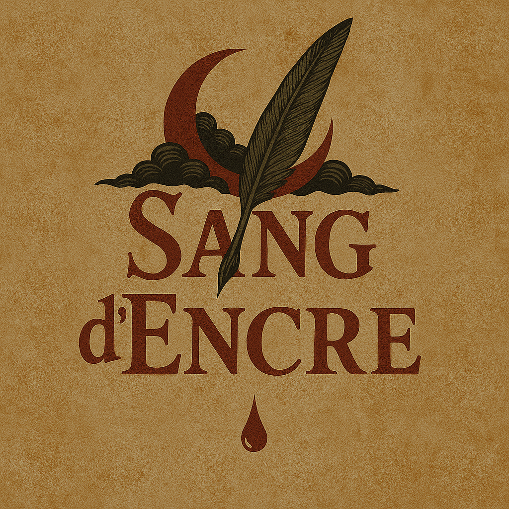
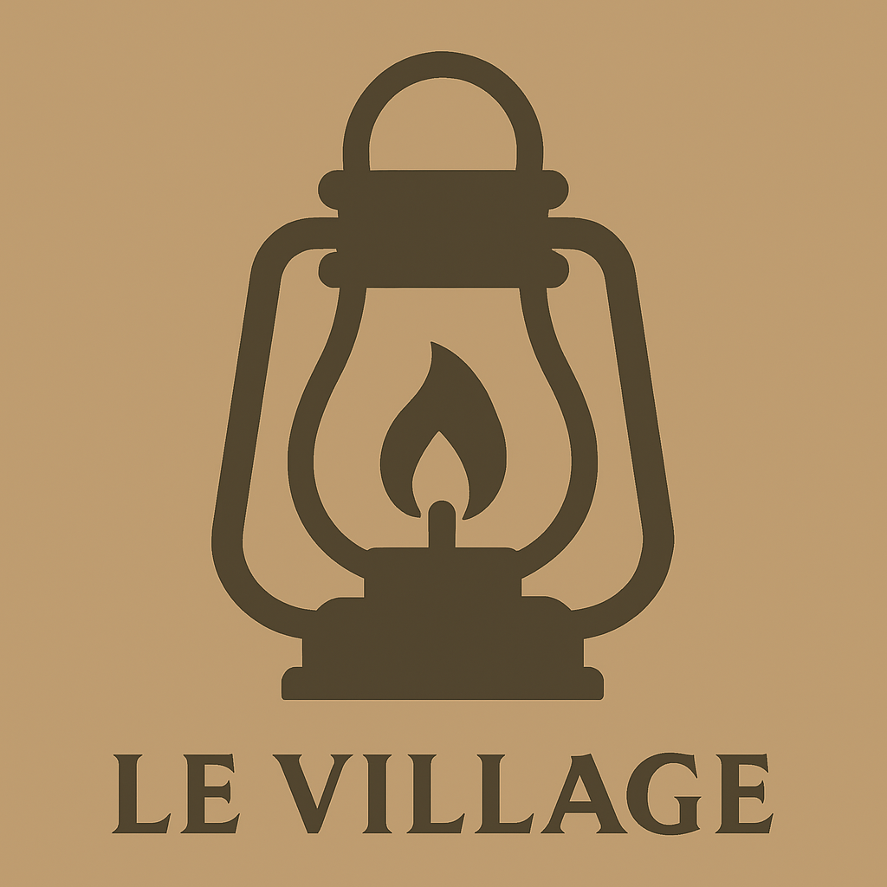
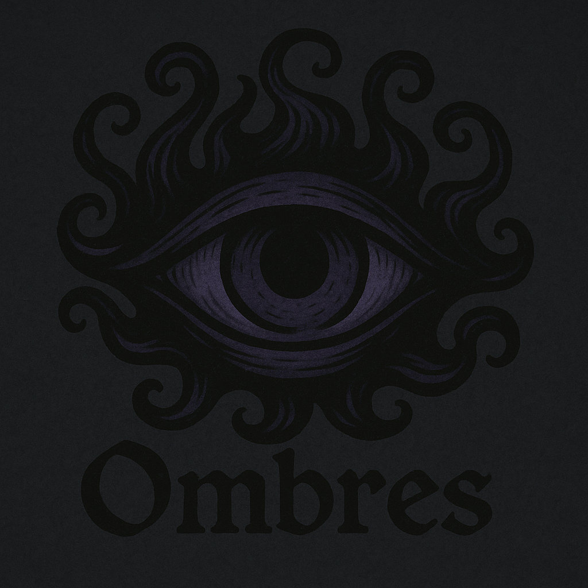
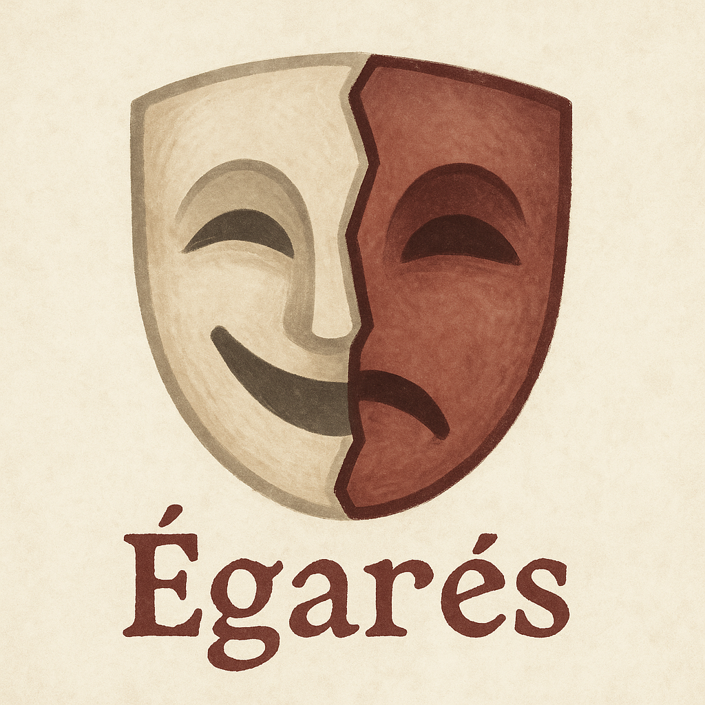

  

  # 🩸 Sang d’Encre

  *Un jeu de rôle social, de bluff et de secrets, inspiré du Loup-Garou, dans un univers gothique et mystérieux.*

  
  

---

## 🕯 Présentation

**Sang d’Encre** est un jeu d’ambiance et de déduction se déroulant dans le village brumeux d’**Encreval**, théâtre d’une lutte impitoyable entre les habitants, les **Ombres**, et d’étranges personnages **neutres** aux desseins troubles.

---

## 📜 Fonctionnement

- ⚔️ Phase de **nuit** : les rôles agissent dans l’ombre (assassinats, enquêtes, manipulations…)
- 🕊 Phase de **jour** : les débats s’ouvrent, les accusations pleuvent, un vote élimine un suspect.
- 🎭 Des **pouvoirs variés** influencent chaque tour, parfois de façon invisible.

Le jeu peut être joué **à l’oral**, avec ou sans application d’aide.

---

## 🧩 Camps du jeu

|  |  |  |
|:--:|:--:|:--:|
| **Le Village** | **Les Ombres** | **Les Égarés** |
| Coopèrent pour survivre et voter les menaces | Tuent la nuit, mentent le jour | Ont des objectifs personnels |

--- 

## 🧩 Contenu

- 📖 [`ROLES.md`](ROLES.md) : tous les rôles jouables (de 6 à 19 joueurs)
- 📚 [`RULES.md`](RULES.md) : règles orales simples (MJ + Joueurs)
- 🛠 [`TODO.md`](TODO.md) : idées à implémenter, extensions futures
- ⚙️ Fichiers pour application ou interface à venir (open source)

---

## 🏠 Lieu : Encreval

Un ancien village isolé entre brume et forêts d’encre, où chaque nuit réveille des souvenirs oubliés, et où même l’écriture peut tuer.

Des mystères hantent ses ruelles. Nul ne sait à qui se fier.  
Même les pierres semblent écouter…

---

## 🖌️ Univers graphique

L’esthétique s’inspire de l’encre, du papier, et du sang :  
**Rouge carmin**, **noir mat**, **plumes**, **sceaux**, et **manuscrits gothiques**.

> Le logo est disponible dans le dossier `assets/`.

---

## 📦 Installation (à venir)

Une interface numérique sera proposée prochainement (site ou application locale).  
Le dépôt contiendra :

- un moteur de distribution de rôles
- un assistant MJ (séquencement, votes, pouvoirs)
- des extensions thématiques

---

## 📖 Licence

> Projet publié sous licence **Creative Commons BY-SA 4.0**.  
> Vous êtes libres de le partager, l’adapter, en créditant l’auteur original.

---

## ❤️ Contribuer

Tout le monde peut contribuer :
- Signaler un bug ou une erreur de règle
- Proposer de nouveaux rôles
- Participer au développement de l’interface
- Illustrer l’univers d’Encreval

> Rejoignez la création du plus stylé des jeux d’ambiance narratifs.

---

## ✒️ Auteur

Créé par **Noctyra**, avec passion, mystère… et beaucoup d’encre.

---

